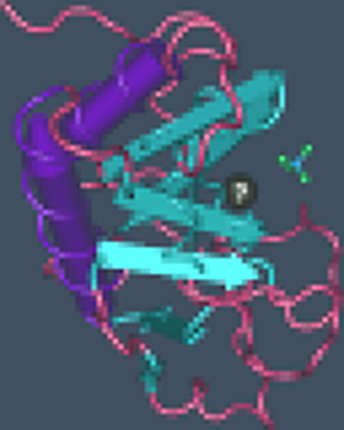
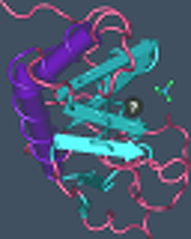
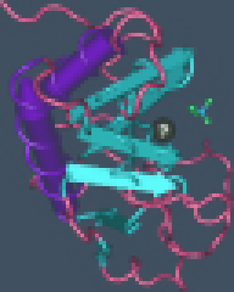
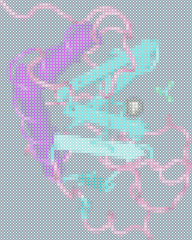

b_cos
=====
An image resizing/resampling algorithm.

## Goals
1. The math ought to be the same for both zoomed-in views and zoomed-out views,
   and at 1:1 the resampled image should exactly match the original image.
2. The resampled image, when blown up, should not show discontinuities between
   source pixels. (i.e. blend the pixels together like
   [bilinear](https://en.wikipedia.org/wiki/Bilinear_interpolation) or
   [bicubic](https://en.wikipedia.org/wiki/Bicubic_interpolation) resampling,
   and not like
   [nearest-neighbor interpolation](https://en.wikipedia.org/wiki/Nearest-neighbor_interpolation).)
3. The resampled image, when shrunk, should average pixels together so as to
   minimize aliasing artifacts.

## An assumption
The color at each pixel in an image represents the average of a small square
area* from a continuous 2D surface ±0.5 pixel-sized units from the pixel origin
in the x and y direction. This is held to be true for both the input and output
image.

*Counterpoint: Smith, Alvy Ray (July 17, 1995). [A Pixel is Not a Little
Square, a Pixel is Not a Little Square, a Pixel is Not a Little Square! (And a
Voxel is Not a Little Cube)](http://alvyray.com/Memos/CG/Microsoft/6_pixel.pdf).

## Design
Ultimately, this calls for a
[reconstruction kernel](https://en.wikipedia.org/wiki/Signal_reconstruction) —
let's call it b\_cos(x) — such that ∫b\_cos(_x_) _dx_ = 1 in the range [-0.5,
0.5], but for any range [j-0.5, j+0.5] where j is an integer ≠ 0, ∫b_cos(x) dx =
0.

The kernel implemented here is built from a sum of cosine waves of varying
frequencies and magnitudes. The result looks a bit like a
[Lanczos kernel](https://en.wikipedia.org/wiki/Lanczos_resampling), though the
b\_cos kernel stops at half-integers rather than integers. The b\_cos kernel
has a greater magnitude as well. [Notes.wxm](Notes.wxm) explains in further
detail how the math works.

It looks like this:


`b_cos` (the program) does simple integration on the two-dimensional surface
obtained by applying the b\_cos reconstruction kernel to the source image in
order to get pixels for the destination image.

## Usage

```
make
./b_cos src.png dest.png dest_width dest_height radius
```

`dest_width` and `dest_height` must both be integers greater than 0. `radius` is
the number of neighboring pixels covered by the kernel (try `2`) — larger gives
rounder features, but it has more ringing artifacts, and it's slower to run.

## Examples

Here's an original image:


Let's shrink it first, with `b_cos original.png small.png 64 80 2` — no real
surprises here:


Now let's try blowing up that small image a few times, to 384x480, six times
larger. For reference purposes, here it is with nearest neighbor resampling:


Here it is with `b_cos original.png small.png 384 480 1`. Pixels from the
original are pretty obvious, but they blend into one another.



Again, with `b_cos original.png small.png 384 480 2`. With radius = 2, things
look much closer to
[bicubic](https://en.wikipedia.org/wiki/Bicubic_interpolation) or
[Lanczos](https://en.wikipedia.org/wiki/Lanczos_resampling) resampling as
implemented by your favorite image editor. Sharp diagonal edges are noticeably
wavy, roughly following pixel boundaries. Still, radius = 2 seems to be a good
compromise between ringing and blockiness.



And again, with `b_cos original.png small.png 384 480 3`. Radius = 3 doesn't add
much of value, but it does add more
[ringing](https://en.wikipedia.org/wiki/Ringing_artifacts):


Bringing things up to a pathological radius = 9, we see lots of ringing. Some
of the diagonal edges are smoothed out better than they were. And also the image
is a wobbly, nervous mess:


And for the record, here's Sinc (Lanczos3) resampling as implemented by
[GIMP](https://www.gimp.org/). Blurrier, but let's face it, it looks much nicer
than anything that `b_cos` outputs.


That said, one interesting thing about b\_cos (that doesn't work with GIMP's
Sinc resampling) is that if you run a
[pixelize effect](https://docs.gimp.org/2.8/en/plug-in-pixelize.html) on the
output of a b\_cos-upsampled image such that the pixelize effect lines up with
the pixels in the smaller source image, you more-or-less get the source image
back (minus precision loss and clipping due to
[overshoot](https://en.wikipedia.org/wiki/Overshoot_(signal))). The following,
for example, is a pixelized version from the above radius = 9 image:



Also, it's not too useful, but radius = 0 technically works. Because the
reconstruction kernel doesn't extend past the rectangle encompassing the source
pixel, it can't blend into its neighbors, so the math just drops it to zero at
the pixel's edge, and the end result ends up being a halftone pattern. b\_cos
operates on an alpha channel whether one existed in the source image or not, so
alpha gets the halftone effect as well.



License
-------

b_cos is copyright (C) 2017 Dave Odell <<dmo2118@gmail.com>>

This program is free software: you can redistribute it and/or modify it under
the terms of the GNU General Public License as published by the Free Software
Foundation, version 3.

This program is distributed in the hope that it will be useful, but WITHOUT ANY
WARRANTY; without even the implied warranty of MERCHANTABILITY or FITNESS FOR A
PARTICULAR PURPOSE.  See the GNU General Public License for more details.

You should have received a copy of the GNU General Public License along with
this program.  If not, see <https://www.gnu.org/licenses/>.
